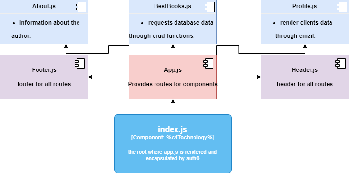

# react: Can of books 

# `Author Name : Mamoun kamal ismael alshishani`

# `Email : mamoun.bursi@yahoo.com`

## server: can_of_books_backend

## how to run the server application working

### 1.Run the application by `npm start` on terminal

`-________________________________________________________________________-`

### what technologies and tools are used on the server  :

***1.`React`: is used for this client side (frontEnd) application***

***2.`Class Component` : generally Class Components and class methods are used to contain data and all functionality as well  ***

***3.`react-bootstrap-components` Components like Cards and Modal and buttons etc.. have been used***

***4.`HTTP CRUD Operations` are used on application ENDPOINTS***

***5.`Auth0` have been used as a way of authentication***

## `server deployed on heroku`

**base endpoint :**
[Heroku Link](https://can-of-books-srv.herokuapp.com/)

**get database data endpoint :**
[Heroku Link](https://can-of-books-srv.herokuapp.com/books?EmailQuery=mamoun.alshishani@yahoo.com) 

## `Server UML :`

